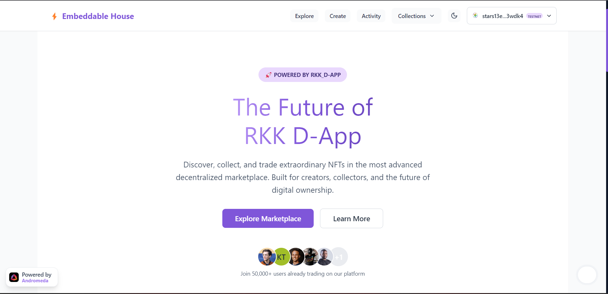
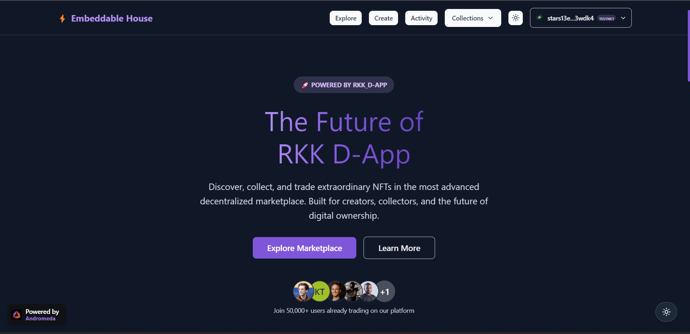
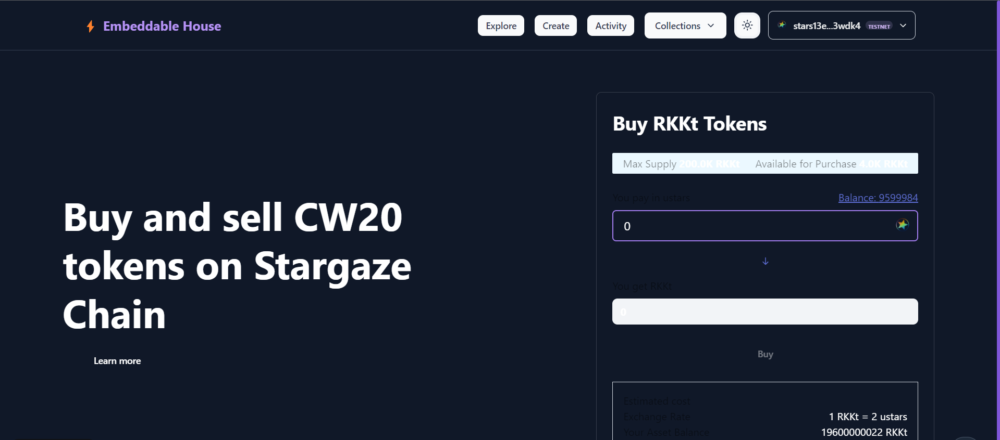
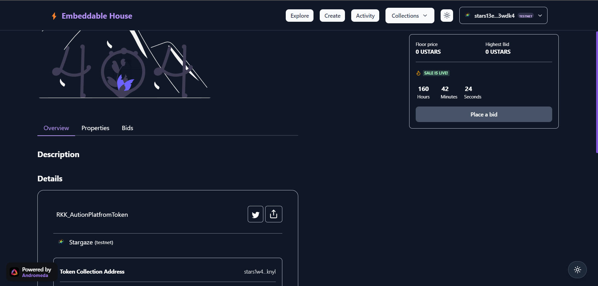

# 🚀 RKK_D-App 🚀

<div align="center">


**A modern, responsive RKK_D-App built with Next.js and powered by Andromeda Protocol**

[](https://nextjs.org/)
[](https://reactjs.org/)
[](https://www.typescriptlang.org/)
[](https://chakra-ui.com/)
[](https://www.framer.com/motion/)

[Live Demo](#) • [Documentation](#features) • [API Reference](#tech-stack) • [Contributing](./CONTIBUTING.md)

</div>

---

## 📘 Project Description

This project is a fully embeddable and responsive RKK_D-APP powered by **Andromeda Protocol**. Built with **Next.js 13**, it features **Chakra UI** components with **Framer Motion** animations, real-time blockchain interactions via **CosmWasm**, and native support for **Keplr Wallet**. Users can discover RKK_D-App, participate in auctions, manage collections, and even embed token exchanges into any site.

---

## 🔭 Vision Statement

The vision behind this project is to empower creators, developers, and communities to launch decentralized marketplaces quickly and beautifully. With blockchain complexity abstracted away, our goal is to bring **Web3 to Web2 simplicity** — enabling real-world use cases through modular, embeddable tools that unlock ownership, liquidity, and opportunity.

---

## 🧑‍💻 About Me

- **Name**: Rohit Kumar Kundu
- **University**: Sister Nivedita University
- **Role**: Blockchain Developer & Web3 Explorer
- **Projects**: BitMint Pay, TrustPay Card, ELEGENT_Card
- **Focus**: RKK_D-App, cross-chain UX, DeFi for creators
- **GitHub**: [ROHIT8759](https://github.com/ROHIT8759)

---

## 📖 Personal Story

As a blockchain student-developer, I was curious about how smart contracts could power digital economies. This curiosity led to exploring Andromeda Protocol. With this marketplace, I’m combining beautiful frontend design with powerful Web3 functionality to simplify how creators and communities interact with blockchain tech.

---

## ✨ Features

### 🎨 **Modern UI Framework**

- **Chakra UI**: Complete component library with enhanced dark mode
- **Framer Motion**: Smooth animations and transitions
- **Responsive Design**: Mobile-first approach with breakpoint optimization
- **Consistent Design**: Unified experience across all components

### 🌙 **Advanced Theme System**

- **Dark/Light Mode**: System preference detection with manual override
- **Responsive Design**: Mobile-first approach with breakpoint optimization
- **Animation Support**: Smooth transitions powered by Framer Motion
- **Accessibility**: WCAG 2.1 compliant with keyboard navigation

### 🏪 **Marketplace Features**

- **Auction System**: Real-time bidding with live updates
- **Token Exchange**: Multi-token trading capabilities
- **Collection Management**: Comprehensive collection analytics
- **Embeddable Components**: Ready-to-use marketplace widgets

### 🔗 **Blockchain Integration**

- **Andromeda Protocol**: Native integration with Andromeda.js
- **CosmWasm**: Smart contract interactions
- **Keplr Wallet**: Secure wallet connection
- **Multi-Chain**: Support for Cosmos ecosystem

### 🧩 **Extensible Architecture**

- **Modular Design**: Easy to add new collection types
- **Configurable Collections**: Simple configuration in `src/config.ts`
- **Additional Features**: Crowdfunding module available (not configured by default)
- **Plugin System**: Support for custom marketplace features

## 🚀 Quick Start

### Prerequisites

- **Node.js** 16.x or later
- **npm** or **yarn**
- **Git**

### Installation

```bash
# Clone the repository
git clone https://github.com/ROHIT8759/RKK_D-App.git
cd RKK_D-App

# Install dependencies
npm install

# Start development server
npm run dev
```

🎉 **Visit [http://localhost:3000](http://localhost:3000)** to see the marketplace in action!

### � **Theme Toggle**

Click the theme toggle button in the top-right corner to switch between light and dark modes.

## 📱 Screenshots

### Landing Page

<div align="center">


</div>

### RKK_Marketplace

<div align="center">

</div>

### RKK_Excgange

<div align="center">

</div>

### RKK_Auction

<div align="center">

</div>

## 🛠 Tech Stack

### **Frontend**

- **[Next.js 13.5.2](https://nextjs.org/)** - React framework with App Router
- **[React 18.2.0](https://reactjs.org/)** - UI library with concurrent features
- **[TypeScript 4.8.3](https://www.typescriptlang.org/)** - Type safety and better DX

### **UI Framework**

- **[Chakra UI 2.8.1](https://chakra-ui.com/)** - Modular and accessible components
- **[Framer Motion 10.16.4](https://www.framer.com/motion/)** - Animation library
- **[Lucide React](https://lucide.dev/)** - Beautiful SVG icons

### **Blockchain**

- **[Andromeda.js](https://github.com/andromedaprotocol/andromeda.js)** - Protocol SDK
- **[CosmJS](https://github.com/cosmos/cosmjs)** - Cosmos ecosystem client
- **[GraphQL](https://graphql.org/)** - Data query language

### **State Management**

- **[Zustand](https://github.com/pmndrs/zustand)** - Lightweight state management
- **[React Query](https://tanstack.com/query)** - Server state management
- **[Apollo Client](https://www.apollographql.com/docs/react/)** - GraphQL client

## 📁 Project Structure

```
embeddable-marketplace-demo/
├── 📁 app/                     # Next.js App Router
│   ├── 📁 [chain]/            # Dynamic chain routes
│   ├── 📁 preview/            # Preview pages
│   └── 📄 layout.tsx          # Root layout
├── 📁 src/
│   ├── 📁 lib/                # Core libraries
│   │   ├── 📁 andrjs/         # Andromeda.js utilities
│   │   ├── 📁 browser/        # Browser-specific code
│   │   └── 📁 graphql/        # GraphQL setup
│   ├── 📁 modules/            # Feature modules
│   │   ├── 📁 home/           # Landing page components
│   │   ├── 📁 marketplace/    # Marketplace features
│   │   ├── 📁 collection/     # Collection management
│   │   ├── 📁 auction/        # Auction system
│   │   ├── 📁 exchange/       # Token exchange
│   │   ├── 📁 cw20/           # CW20 token support
│   │   ├── 📁 cw721/          # CW721 NFT support
│   │   └── 📁 common/         # Shared components
│   ├── 📁 theme/              # UI theme configuration
│   └── 📁 utils/              # Utility functions
├── 📁 public/                 # Static assets
└── 📄 package.json           # Dependencies & scripts
```

## 🎯 Available Scripts

```bash
# Development
npm run dev          # Start development server
npm run build        # Build for production
npm run start        # Start production server

# Code Quality
npm run lint         # Run ESLint
npm run tsc          # Type checking

# Export
npm run export       # Static export
```

## 🔧 Configuration

### Environment Variables

Create a `.env.local` file:

```env
# Andromeda Protocol Configuration
NEXT_PUBLIC_ANDROMEDA_GRAPHQL_URL=https://graphql.testnet.andromedaprotocol.io/
NEXT_PUBLIC_ANDROMEDA_REST_URL=https://rest.testnet.andromedaprotocol.io/
NEXT_PUBLIC_ANDROMEDA_RPC_URL=https://rpc.testnet.andromedaprotocol.io/

# Chain Configuration
NEXT_PUBLIC_CHAIN_ID=andromeda-1
NEXT_PUBLIC_CHAIN_NAME=Andromeda Testnet
```

### Tailwind CSS Setup

The project includes Tailwind CSS integration alongside Chakra UI for additional styling flexibility:

- **Chakra UI Components** - Primary component library
- **Tailwind Utilities** - Additional styling utilities with `tw-` prefix
- **Dark Mode Support** - Consistent theming across both systems
- **Custom Animations** - Enhanced with Framer Motion

See [`src/styles/globals.css`](./src/styles/globals.css) for Tailwind configuration.

## 🧩 Embeddable Marketplace

Access the live embeddable marketplace here:

[https://embeddables.testnet.andromedaprotocol.io/elgafar-1/rkk-dapp](https://embeddables.testnet.andromedaprotocol.io/elgafar-1/rkk-dapp)

Embed this link in your website or application to provide instant access to the Andromeda Protocol token exchange.

## 🌟 Key Features Deep Dive

### 🎨 **Theme System**

- **Automatic Detection**: Respects system preferences
- **Manual Override**: User can toggle themes manually
- **Persistent State**: Remembers user preference
- **Smooth Transitions**: Animated theme switching

### 🔄 **Theme System**

- **Real-time Switching**: Seamless light/dark mode toggle
- **State Preservation**: Remembers user preference across sessions
- **System Integration**: Respects OS theme preference by default
- **Smooth Transitions**: Animated theme switching with Framer Motion

### 📱 **Responsive Design**

- **Mobile First**: Optimized for touch interfaces
- **Progressive Enhancement**: Works on all devices
- **Flexible Layouts**: Adapts to any screen size
- **Touch Friendly**: Large touch targets and gestures

## 🤝 Contributing

We welcome contributions! Please see our [Contributing Guide](./CONTIBUTING.md) for details.

### Development Workflow

1. **Fork** the repository
2. **Create** a feature branch (`git checkout -b feature/amazing-feature`)
3. **Commit** your changes (`git commit -m 'Add amazing feature'`)
4. **Push** to the branch (`git push origin feature/amazing-feature`)
5. **Open** a Pull Request

### Code Style

- **ESLint**: Code linting and formatting
- **Prettier**: Consistent code formatting
- **TypeScript**: Type safety throughout
- **Conventional Commits**: Structured commit messages


## 🔗 Links

- **[Documentation](https://docs.andromedaprotocol.io/)** - Protocol documentation


## 🙏 Acknowledgments

- **Andromeda Protocol Team** - For the amazing blockchain infrastructure
- **Cosmos Ecosystem** - For the robust blockchain foundation
- **Open Source Community** - For the incredible tools and libraries

---

<div align="center">

**Built with ❤️ by the Andromeda Protocol Community**

⭐ **Star this repo if you find it helpful!** ⭐

</div>
