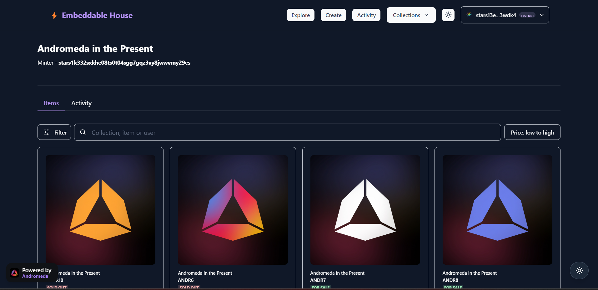

# 🚀 Andromeda Protocol Embeddable Marketplace Demo

<div align="center">


**A modern, responsive NFT marketplace built with Next.js and powered by Andromeda Protocol**

[](https://nextjs.org/)
[](https://reactjs.org/)
[](https://www.typescriptlang.org/)
[](https://chakra-ui.com/)
[](https://tailwindcss.com/)

[Live Demo](#) • [Documentation](#features) • [API Reference](#tech-stack) • [Contributing](./CONTIBUTING.md)

</div>

## ✨ Features

### 🎨 **Dual UI Framework Support**

- **Chakra UI**: Complete component library with enhanced dark mode
- **Tailwind CSS**: Utility-first framework for custom designs
- **Seamless Toggle**: Switch between frameworks in real-time
- **Consistent Design**: Unified experience across both implementations

### 🌙 **Advanced Theme System**

- **Dark/Light Mode**: System preference detection with manual override
- **Responsive Design**: Mobile-first approach with breakpoint optimization
- **Animation Support**: Smooth transitions powered by Framer Motion
- **Accessibility**: WCAG 2.1 compliant with keyboard navigation

### 🏪 **Marketplace Features**

- **NFT Discovery**: Browse collections with advanced filtering
- **Auction System**: Real-time bidding with live updates
- **Crowdfunding**: Support for community-driven projects
- **Token Exchange**: Multi-token trading capabilities
- **Collection Management**: Comprehensive collection analytics

### 🔗 **Blockchain Integration**

- **Andromeda Protocol**: Native integration with Andromeda.js
- **CosmWasm**: Smart contract interactions
- **Keplr Wallet**: Secure wallet connection
- **Multi-Chain**: Support for Cosmos ecosystem

## 🚀 Quick Start

### Prerequisites

- **Node.js** 16.x or later
- **npm** or **yarn**
- **Git**

### Installation

```bash
# Clone the repository
git clone https://github.com/ROHIT8759/embeddable-marketplace.git
cd embeddable-marketplace

# Install dependencies
npm install

# Start development server
npm run dev
```

🎉 **Visit [http://localhost:3000](http://localhost:3000)** to see the marketplace in action!

### 🎛️ Framework Toggle

Use the toggle button in the navigation bar to switch between:

- **Chakra UI** - Component-based approach
- **Tailwind CSS** - Utility-first styling

## 📱 Screenshots

### Landing Page

<div align="center">


</div>

### NFT Marketplace

<div align="center">


</div>

## 🛠 Tech Stack

### **Frontend**

- **[Next.js 13.5.2](https://nextjs.org/)** - React framework with App Router
- **[React 18.2.0](https://reactjs.org/)** - UI library with concurrent features
- **[TypeScript 4.8.3](https://www.typescriptlang.org/)** - Type safety and better DX

### **UI Frameworks**

- **[Chakra UI 2.8.1](https://chakra-ui.com/)** - Modular and accessible components
- **[Tailwind CSS 3.0+](https://tailwindcss.com/)** - Utility-first CSS framework
- **[Framer Motion 10.16.4](https://www.framer.com/motion/)** - Animation library

### **Blockchain**

- **[Andromeda.js](https://github.com/andromedaprotocol/andromeda.js)** - Protocol SDK
- **[CosmJS](https://github.com/cosmos/cosmjs)** - Cosmos ecosystem client
- **[GraphQL](https://graphql.org/)** - Data query language

### **State Management**

- **[Zustand](https://github.com/pmndrs/zustand)** - Lightweight state management
- **[React Query](https://tanstack.com/query)** - Server state management
- **[Apollo Client](https://www.apollographql.com/docs/react/)** - GraphQL client

## 📁 Project Structure

```
embeddable-marketplace-demo/
├── 📁 app/                     # Next.js App Router
│   ├── 📁 [chain]/            # Dynamic chain routes
│   ├── 📁 preview/            # Preview pages
│   └── 📄 layout.tsx          # Root layout
├── 📁 src/
│   ├── 📁 lib/                # Core libraries
│   │   ├── 📁 andrjs/         # Andromeda.js utilities
│   │   ├── 📁 browser/        # Browser-specific code
│   │   └── 📁 graphql/        # GraphQL setup
│   ├── 📁 modules/            # Feature modules
│   │   ├── 📁 home/           # Landing page components
│   │   ├── 📁 marketplace/    # Marketplace features
│   │   ├── 📁 collection/     # Collection management
│   │   ├── 📁 auction/        # Auction system
│   │   └── 📁 common/         # Shared components
│   ├── 📁 theme/              # UI theme configuration
│   └── 📁 utils/              # Utility functions
├── 📁 public/                 # Static assets
└── 📄 package.json           # Dependencies & scripts
```

## 🎯 Available Scripts

```bash
# Development
npm run dev          # Start development server
npm run build        # Build for production
npm run start        # Start production server

# Code Quality
npm run lint         # Run ESLint
npm run tsc          # Type checking

# Export
npm run export       # Static export
```

## 🔧 Configuration

### Environment Variables

Create a `.env.local` file:

```env
# Andromeda Protocol Configuration
NEXT_PUBLIC_ANDROMEDA_GRAPHQL_URL=https://graphql.testnet.andromedaprotocol.io/
NEXT_PUBLIC_ANDROMEDA_REST_URL=https://rest.testnet.andromedaprotocol.io/
NEXT_PUBLIC_ANDROMEDA_RPC_URL=https://rpc.testnet.andromedaprotocol.io/

# Chain Configuration
NEXT_PUBLIC_CHAIN_ID=andromeda-1
NEXT_PUBLIC_CHAIN_NAME=Andromeda Testnet
```

### Tailwind CSS Setup

The project includes a complete Tailwind CSS configuration with:

- **Custom Color Palette** - Andromeda Protocol branding
- **Dark Mode Support** - Class-based dark mode
- **Custom Animations** - Smooth transitions and effects
- **Responsive Breakpoints** - Mobile-first design

See [`TAILWIND_INTEGRATION.md`](./TAILWIND_INTEGRATION.md) for detailed setup instructions.

## 🧩 Embeddable Marketplace

Access the live embeddable marketplace here:

[https://embeddables.testnet.andromedaprotocol.io/elgafar-1/rkk-token-exchange/embeddables-exchange-1](https://embeddables.testnet.andromedaprotocol.io/elgafar-1/rkk-token-exchange/embeddables-exchange-1)

Embed this link in your website or application to provide instant access to the Andromeda Protocol token exchange.

## 🌟 Key Features Deep Dive

### 🎨 **Theme System**

- **Automatic Detection**: Respects system preferences
- **Manual Override**: User can toggle themes manually
- **Persistent State**: Remembers user preference
- **Smooth Transitions**: Animated theme switching

### 🔄 **Framework Toggle**

- **Real-time Switching**: No page reload required
- **State Preservation**: Maintains application state
- **Performance Optimized**: Code splitting for each framework
- **Consistent UX**: Same functionality across frameworks

### 📱 **Responsive Design**

- **Mobile First**: Optimized for touch interfaces
- **Progressive Enhancement**: Works on all devices
- **Flexible Layouts**: Adapts to any screen size
- **Touch Friendly**: Large touch targets and gestures

## 🤝 Contributing

We welcome contributions! Please see our [Contributing Guide](./CONTIBUTING.md) for details.

### Development Workflow

1. **Fork** the repository
2. **Create** a feature branch (`git checkout -b feature/amazing-feature`)
3. **Commit** your changes (`git commit -m 'Add amazing feature'`)
4. **Push** to the branch (`git push origin feature/amazing-feature`)
5. **Open** a Pull Request

### Code Style

- **ESLint**: Code linting and formatting
- **Prettier**: Consistent code formatting
- **TypeScript**: Type safety throughout
- **Conventional Commits**: Structured commit messages

## 📄 License

This project is licensed under the MIT License - see the [LICENSE](./LICENSE) file for details.

## 🔗 Links

- **[Andromeda Protocol](https://andromedaprotocol.io/)** - Official website
- **[Documentation](https://docs.andromedaprotocol.io/)** - Protocol documentation
- **[Discord](https://discord.gg/andromedaprotocol)** - Community chat
- **[Twitter](https://twitter.com/andromedaprot)** - Latest updates

## 🙏 Acknowledgments

- **Andromeda Protocol Team** - For the amazing blockchain infrastructure
- **Cosmos Ecosystem** - For the robust blockchain foundation
- **Open Source Community** - For the incredible tools and libraries

---

<div align="center">

**Built with ❤️ by the Andromeda Protocol Community**

⭐ **Star this repo if you find it helpful!** ⭐

</div>
